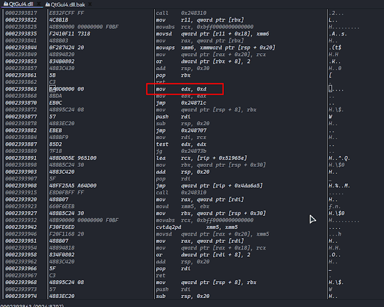

# 修改DAZ Studio UI字体大小

利用rehex对比，此处为字体大小十六进制数值，修改 2393864: 0D CC -> 2393864: 10 CC，大小从13到16
<!-- more -->

---

> 作者: [Jason](https://github.com/actforjason)  
> URL: https://actforjason.github.io/posts/%E4%BF%AE%E6%94%B9daz-studio-ui%E5%AD%97%E4%BD%93%E5%A4%A7%E5%B0%8F/  

